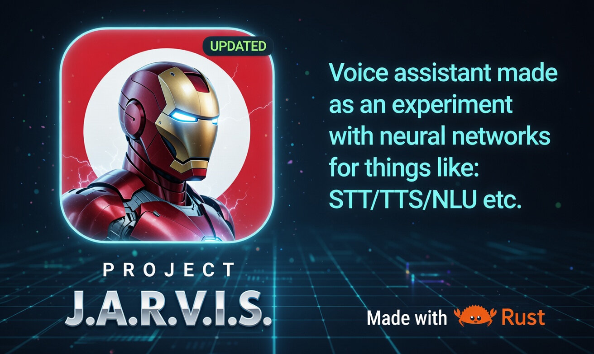
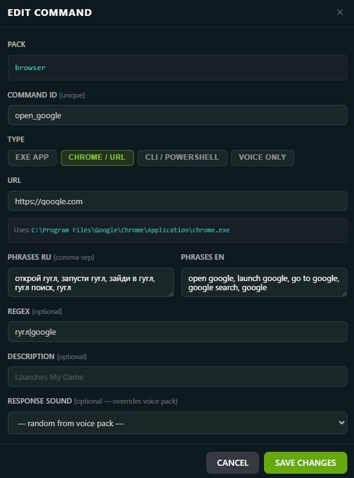
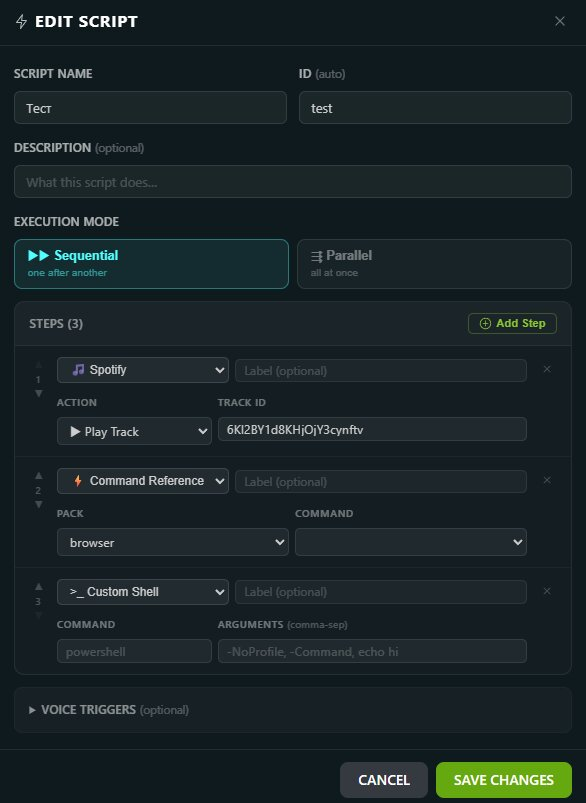
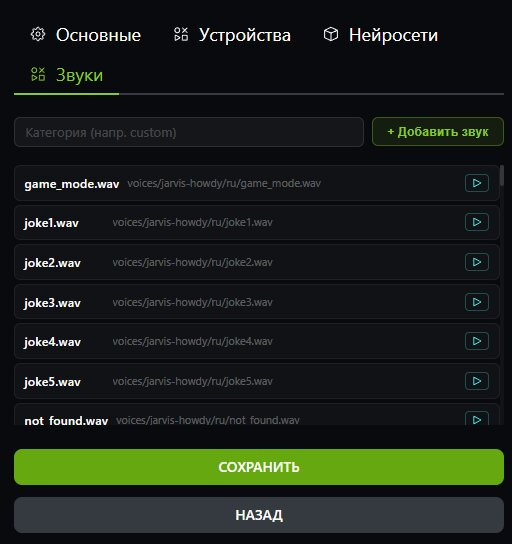

# JARVIS Voice Assistant



> **100% offline · Open source · No data collection**

A privacy-first voice assistant built with Rust and Tauri. Speak a command — JARVIS hears it, understands it, and acts. No cloud, no subscription, no telemetry.

**This fork** extends the original [Priler/jarvis](https://github.com/Priler/jarvis) with a full **Commands & Scripts system** — a low-code GUI for building personal voice-activated workflows without writing any Rust code.

---

## What this fork adds

| Feature | Description |
|---|---|
| **Commands GUI** | Create, edit and delete voice commands through a visual interface |
| **Scripts Engine** | Chain multiple commands into sequential or parallel workflows |
| **Voice-activated workflows** | Trigger any script with a spoken phrase or regex pattern |
| **Scripting without code** | Build automations (open app → wait → play music) entirely from the GUI |
| **Custom voice responses** | Assign specific audio responses per command or script |
| **Sound Manager** | Browse, import and preview voice pack sounds from Settings |

**Example use case:** Say *"work mode"* → JARVIS opens Chrome with YouTube, waits 2 seconds, then starts your Spotify playlist — all configured through the GUI, no code needed.

---

## Commands & Scripts Visual Guide

Below is an overview of the key features added in this fork, illustrated with the new interface elements.

### 1. Command Editor

A **Command** is a single action triggered by a specific voice phrase. You can now manage them entirely through the GUI.



* **Action Types**: Supports launching applications (`EXE APP`), opening URLs (`CHROME / URL`), terminal commands (`CLI / POWERSHELL`), and voice-only intents (`VOICE ONLY`).
* **Multi-language Support**: Define different trigger phrases for various languages (e.g., English and Russian) within the same command.
* **Response Sound**: Assign a specific audio response that plays when this command is triggered (overrides the default voice pack).

### 2. Script Editor & Step Builder

A **Script** allows you to automate a **multi-step workflow**. It is a powerful tool for creating complex automation scenarios.



* **Execution Mode**: Run steps one by one (`Sequential`) or all at once (`Parallel`).
* **Visual Step Builder**: Add actions via the "+ Add Step" button. Supports delays, cross-command references, Spotify controls, and custom Shell scripts.

### 3. Sound Manager

A new dedicated section in Settings to manage all of the assistant's audio feedback.



* **Browse & Preview**: View all available files in the current voice pack with instant playback for testing.
* **Import Sounds**: The "+ Добавить звук" button allows you to quickly import your own WAV files into the project.
* **Categories**: Easy filtering of sounds by category (e.g., `custom`, `system`).

---

## System Requirements

| Requirement | Minimum | Recommended |
|---|---|---|
| **OS** | Windows 10 x64 | Windows 11 x64 |
| **RAM** | 4 GB | 8 GB |
| **CPU** | Any x64 (2+ cores) | 4+ cores |
| **Microphone** | Any | USB or headset mic |
| **Rust** | 1.75+ | latest stable |
| **Node.js** | 18+ | 20 LTS |
| **Disk space** | 2 GB free | 4 GB free |

> **Linux / macOS:** Not tested. Contributions welcome.

---

## Installation

### Option A — Automatic (recommended)

One script handles everything: checks dependencies, downloads Vosk speech models (~200 MB), and installs frontend packages.

```powershell
# 1. Clone the repository
git clone https://github.com/vovazlo97/jarvis.git
cd jarvis

# 2. Run setup (downloads models, installs npm packages)
powershell -ExecutionPolicy Bypass -File setup.ps1

# 3. Start the app
cd crates/jarvis-gui
cargo tauri dev
```

> First build takes **5–15 minutes** — Rust compiles all dependencies from scratch. Subsequent builds are incremental (under 1 minute).

---

### Option B — Manual step by step

**Step 1 — Install Rust**

Go to https://rustup.rs/ and follow the instructions, or use winget:

```powershell
winget install Rustlang.Rustup
```

Restart your terminal, then verify:

```powershell
rustc --version   # rustc 1.75.0 or later
cargo --version
```

---

**Step 2 — Install Node.js**

Download v18+ (LTS) from https://nodejs.org/

Verify:

```powershell
node --version    # v18.x.x or later
npm --version
```

---

**Step 3 — Install Tauri CLI**

```powershell
cargo install tauri-cli --version "^2"
```

---

**Step 4 — Clone the repository**

```powershell
git clone https://github.com/vovazlo97/jarvis.git
cd jarvis
```

---

**Step 5 — Download Vosk speech models**

Create the `resources/vosk/` directory and download the models below.
Extract each zip so the directory structure matches exactly:

```
resources/
  vosk/
    vosk-model-small-ru-0.22/
    vosk-model-en-us-0.22-lgraph/
    vosk-model-small-uk-v3-nano/
```

| Model folder | Language | Size | Download |
|---|---|---|---|
| `vosk-model-small-ru-0.22` | Russian | ~40 MB | https://alphacephei.com/vosk/models/vosk-model-small-ru-0.22.zip |
| `vosk-model-en-us-0.22-lgraph` | English | ~128 MB | https://alphacephei.com/vosk/models/vosk-model-en-us-0.22-lgraph.zip |
| `vosk-model-small-uk-v3-nano` | Ukrainian | ~10 MB | https://alphacephei.com/vosk/models/vosk-model-small-uk-v3-nano.zip |

---

**Step 6 — Install frontend dependencies**

```powershell
cd frontend
npm install
cd ..
```

---

**Step 7 — Start the application**

```powershell
cd crates/jarvis-gui
cargo tauri dev
```

During the first build, `fastembed` will also download embedding models (~100 MB) automatically. Just let it finish.

---

## Project Structure

```
jarvis/
├── crates/
│   ├── jarvis-core/        # Core library: audio, STT, commands, scripts, intent
│   ├── jarvis-app/         # Voice engine binary (wake word → STT → command routing)
│   ├── jarvis-gui/         # Tauri desktop app (GUI + backend Tauri commands)
│   └── jarvis-cli/         # CLI tool for development and testing
├── frontend/
│   └── src/
│       └── routes/
│           ├── commands/   # Commands GUI (pack list + command editor)
│           └── scripts/    # Scripts GUI (script list + step builder)
├── resources/
│   ├── commands/           # Command packs — one subfolder per pack, each with command.toml
│   │   ├── browser/command.toml
│   │   ├── games/command.toml
│   │   └── ...
│   ├── scripts/            # Script TOML files (created and managed via GUI)
│   ├── sound/              # Voice packs and audio feedback files
│   ├── vosk/               # Vosk STT models (downloaded by setup.ps1, not in git)
│   └── keywords/           # Wake word detection files
├── lib/
│   └── windows/amd64/      # Runtime DLLs required for build (Vosk, PvRecorder)
├── .cargo/
│   └── config.toml         # Linker flags pointing to lib/windows/amd64/
├── setup.ps1               # One-command setup script
├── Cargo.toml              # Workspace manifest
└── Cargo.lock              # Locked dependency versions
```

---

## Commands System

A **command** is a single voice-triggered action — open an application, navigate to a URL, run a shell command, or control the system.

### How a command works

1. You speak a phrase
2. JARVIS transcribes it via Vosk (offline STT)
3. The intent engine matches your phrase against registered commands
4. The matching command executes its action (launches exe, runs CLI, opens URL)
5. JARVIS plays a confirmation sound

### Command file structure

Commands live in `resources/commands/<pack-name>/command.toml`. Each pack is a folder grouping related commands.

**Example — browser pack:**

```toml
[[commands]]
id         = "open_youtube"
type       = "exe"
exe_path   = "C:\\Program Files\\Google\\Chrome\\Application\\chrome.exe"
exe_args   = ["https://youtube.com"]

phrases.ru = ["открой ютуб", "запусти ютуб", "включи ютуб"]
phrases.en = ["open youtube", "launch youtube", "go to youtube"]
patterns   = ["ютуб[а-яё]*|youtube"]

sounds.ru  = ["ok1", "ok2", "ok3"]
```

### Command types

| Type | What it does | Required fields |
|---|---|---|
| `exe` | Launch an executable or open a URL in the default browser | `exe_path`, `exe_args` |
| `cli` | Run a PowerShell or CMD command | `cli_cmd`, `cli_args` |

### Adding a command via GUI

1. Open JARVIS → **Commands** tab in the sidebar
2. Select an existing pack or create a new one
3. Click **Add command**
4. Fill in: ID, type, path/command, voice phrases
5. Click **Save** — the command is active immediately

### Voice matching pipeline

When you speak, JARVIS tries to find a match in this order:

| Step | Method | Threshold |
|---|---|---|
| 1 | Regex pattern match | Exact |
| 2 | Embedding intent classifier | ≥ 88% confidence |
| 3 | Fuzzy (Levenshtein) fallback | ≥ 75% similarity |

If nothing matches → JARVIS plays the `not_found` audio response.

---

## Scripts System

A **script** is a sequence of steps triggered by a single voice phrase. Use scripts to automate multi-step workflows that would otherwise require several separate commands.

### How a script works

1. You speak a trigger phrase assigned to the script
2. JARVIS matches it against registered script triggers
3. All steps execute in the chosen mode (sequential or parallel)
4. JARVIS plays a confirmation sound when done

### Script file structure

Scripts are stored in `resources/scripts/<id>.toml` and fully managed through the GUI.

**Example — "Work Mode" script:**

```toml
id          = "work_mode"
name        = "Work Mode"
description = "Opens browser and starts music for a productive session"
mode        = "sequential"

phrases_ru = ["режим работы", "рабочий режим", "включи рабочий режим"]
phrases_en = ["work mode", "enable work mode", "start work mode"]
patterns   = ["режим.?работ"]

[[steps]]
step_type  = "command_ref"
pack       = "browser"
command_id = "open_youtube"
label      = "Open YouTube"

[[steps]]
step_type = "delay"
delay_ms  = 2000

[[steps]]
step_type        = "spotify"
spotify_action   = "play_track"
spotify_track_id = "4uLU6hMCjMI75M1A2tKUQC"
label            = "Start focus playlist"

[[steps]]
step_type = "custom"
cli_cmd   = "powershell"
cli_args  = ["-Command", "Start-Process notepad"]
label     = "Open Notepad"
```

### Execution modes

| Mode | Behavior |
|---|---|
| `sequential` | Steps run one by one in order; `delay` steps pause execution |
| `parallel` | All steps start simultaneously in separate threads |

### Step types

| Type | Description | Key fields |
|---|---|---|
| `command_ref` | Run an existing command from any pack | `pack`, `command_id` |
| `delay` | Pause execution for N milliseconds | `delay_ms` |
| `custom` | Run any PowerShell or CMD command | `cli_cmd`, `cli_args` |
| `spotify` | Control Spotify playback | `spotify_action`, `spotify_track_id` |

### Adding a script via GUI

1. Open JARVIS → **Scripts** tab in the sidebar
2. Click **New script**
3. Set: ID, name, description, execution mode (`sequential` / `parallel`)
4. Add voice trigger phrases (Russian / English) and/or regex patterns
5. Add steps using the visual step builder
6. Click **Save** — the script is active immediately, no restart needed

---

## Commands vs Scripts

| | Command | Script |
|---|---|---|
| **Purpose** | One action | Multi-step workflow |
| **Storage** | `resources/commands/<pack>/command.toml` | `resources/scripts/<id>.toml` |
| **Steps** | Single (exe or cli) | Many (any combination) |
| **Execution order** | — | Sequential or Parallel |
| **Use when** | "Open Chrome", "Volume up" | "Work mode", "Gaming setup", "Morning routine" |

---

## Adding Custom Workflows

**Scenario:** You want to say *"gaming mode"* and have JARVIS automatically open Steam, wait 3 seconds, then start your gaming Spotify playlist.

**Step 1 — Make sure Steam has a command**

If you don't have a games pack yet, create `resources/commands/games/command.toml`:

```toml
[[commands]]
id         = "open_steam"
type       = "exe"
exe_path   = "C:\\Program Files (x86)\\Steam\\steam.exe"
exe_args   = []
phrases.ru = ["открой стим", "запусти стим"]
phrases.en = ["open steam", "launch steam"]
sounds.ru  = ["ok1", "ok2"]
```

**Step 2 — Create the script in the GUI**

Open Scripts → New script, then configure:

| Field | Value |
|---|---|
| ID | `gaming_mode` |
| Mode | `sequential` |
| Phrases (RU) | `игровой режим`, `режим игры` |
| Phrases (EN) | `gaming mode`, `start gaming` |

Add steps:
1. `command_ref` → pack: `games`, command: `open_steam`
2. `delay` → `3000` ms
3. `spotify` → action: `play_track`, track ID: *(your Spotify track URI)*

Click **Save**.

**Step 3 — Say the phrase**

*"Gaming mode"* — JARVIS launches Steam, waits 3 seconds, starts the music.

---

## Troubleshooting

### Build error: `linker error` or `libvosk not found`

The Rust linker needs the DLLs in `lib/windows/amd64/`. Verify the directory exists:

```powershell
ls lib/windows/amd64/
# Expected: libvosk.dll, libvosk.lib, libpv_recorder.dll, etc.
```

If the folder is missing, re-clone the repository — these files must be present.

### Build error: `cargo-tauri: command not found`

```powershell
cargo install tauri-cli --version "^2"
```

### GUI opens but shows a blank window

Frontend dependencies are missing:

```powershell
cd frontend
npm install
cd ..
cd crates/jarvis-gui
cargo tauri dev
```

### Voice commands are not recognized

1. Open **Windows Sound Settings** → set your microphone as the default recording device
2. Verify models are in `resources/vosk/` with exact folder names (no extra nesting)
3. Read the terminal output where you ran `cargo tauri dev` — errors are printed there
4. Try running setup again: `powershell -ExecutionPolicy Bypass -File setup.ps1`

### First build is very slow (5–15 min)

This is normal. Rust compiles all dependencies from source on the first build. Subsequent builds reuse cached artifacts and take under 1 minute.

### Build downloads ~100 MB during compilation

The `fastembed` crate downloads ONNX embedding model weights on first build. This is automatic and happens only once.

---

## Neural Networks Used

| Purpose | Library | Notes |
|---|---|---|
| Speech-to-Text | [Vosk](https://github.com/alphacep/vosk-api) via [vosk-rs](https://github.com/Bear-03/vosk-rs) | Fully offline |
| Intent Classification | [fastembed](https://github.com/Anush008/fastembed-rs) — all-MiniLM-L6-v2 | Offline, downloads on first build |
| Wake Word | [Rustpotter](https://github.com/GiviMAD/rustpotter) | Partially implemented |

---

## Development

```powershell
# Check all crates compile without building
cargo check --workspace

# Run core library unit tests
cargo test -p jarvis-core

# Start app in development mode (hot reload)
cd crates/jarvis-gui
cargo tauri dev

# Build optimized release binary
cargo tauri build

# Run Rust linter
cargo clippy --workspace
```

Enable verbose logging:

```powershell
$env:RUST_LOG = "debug"
cargo tauri dev
```

---

## Credits

- Original project: [Priler/jarvis](https://github.com/Priler/jarvis) by Abraham Tugalov
- This fork: [@vovazlo97](https://github.com/vovazlo97)

## License

[Attribution-NonCommercial-ShareAlike 4.0 International](https://creativecommons.org/licenses/by-nc-sa/4.0/)
See `LICENSE.txt` for full terms.
